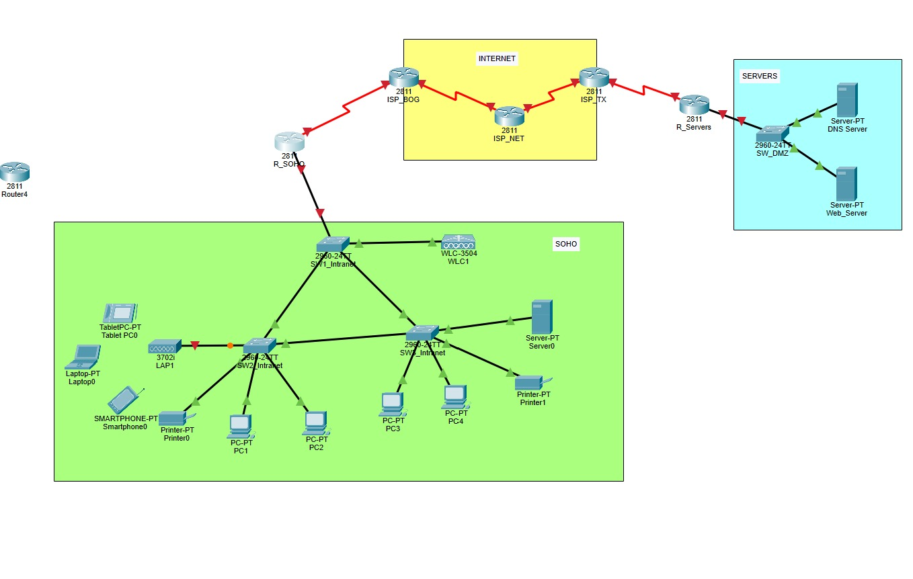

# DocumentacionLab2

## Miembros: Tomas Barrios Guevara, Valentina Ruiz Torres y Darek Aljuri Martínez

## 1. Introducción
En este laboratorio, se busca afianzar los conceptos fundamentales de redes, tales como LAN, WLAN, VLAN, IPv4 y Subneteo, a través de la construcción y configuración de una red SOHO en un entorno emulado con Cisco Packet Tracer. Se implementarán y configurarán servicios esenciales como DHCP, DNS y NAT, asegurando una eficiente asignación de direcciones IP. Asimismo, se establecerán protocolos de enrutamiento EIGRP u OSPF en las interfaces requeridas, permitiendo el correcto enrutamiento de paquetes IP a través de la red WAN. Además, se configurará un servidor HTTP para alojar contenidos web accesibles desde cualquier dispositivo dentro de la red. Durante el desarrollo del laboratorio, se simulará el flujo de datos y se analizará su comportamiento, garantizando que todos los servicios funcionen correctamente.
## 2. Topología de red

La topología mostrada es una red SOHO (Small Office Home Office) con interconexión a Internet y servidores remotos, los componentes principales de esta red son 

### Zona SOHO (en verde):
Incluye dispositivos de una oficina o hogar como PCs, laptops, tablets, impresoras, y un servidor local.
Hay varios PCs conectados por cable Ethernet, así como dispositivos móviles conectados a la red inalámbrica.
Está compuesta por switches (2960-24TT) y un Wireless LAN Controller (WLC) con un Access Point (LAP) para la red inalámbrica.

* Switches 2960-24TT: Según la página oficial de Cisco los Switches Cisco Catalyst 2960-24TT forman parte de la serie Cisco Catalyst 2960. Esta serie es una familia de switches de capa 2 diseñados para implementaciones en redes de pequeñas y medianas empresas, además cuentan con "24 y 48 puertos de conectividad Gigabit Ethernet (GbE) de escritorio 10/100/1000 " [1].
  
* Wireless LAN Controller: "Un controlador WLAN gestiona los puntos de acceso de red inalámbrica que permiten a los dispositivos inalámbricos conectarse a la red." [2]. Otra de sus funciones es centralizar la administración de la red Wi-Fi, lo que permite a los administradores gestionar configuraciones, políticas de seguridad y monitoreo de rendimiento de manera más eficiente.
  
*  Access Point (LAP): Un punto de acceso, es un dispositivo de red que permite la conexión de dispositivos inalámbricos a una red cableada. Actúa como un puente entre los dispositivos inalámbricos (como teléfonos, laptops y tabletas) y la red local (LAN). En este caso se usó un Lightweight Access Point (LAP) que es un punto de acceso (AP) que está diseñado para ser conectado a un controlador de red inalámbrica (WLC)." [3] Es decir que a diferencia de los Access point tradicionales los LAPs dependen de un controlador para gestionar su configuración, seguridad y operación.

### Interconexión WAN (en amarillo):

La topología muestra una conexión a Internet mediante routers (Cisco 2811) que representan diferentes puntos de conexión: ISP_BOG, ISP_NET, e ISP_TX.
Estos routers permiten la comunicación entre la red SOHO y servidores externos.

* El Cisco 2811 es un router de la serie 2800 de Cisco, diseñado principalmente para pequeñas y medianas empresas. Ofrece una combinación de funcionalidades de red y seguridad

### Zona de servidores (en azul):

Aquí se encuentran un servidor DNS y un servidor web, conectados a un switch (2960-24TT), que ofrece servicios externos.

## 3. Síntesis de la metodología y resultados de configuración: 
* Montaje de la topología: Utilizando el cableado estructurado y los modelos de dispositivos indicados (Switches Cisco 2960, Router Cisco 2811, WLC 3504 y LAP 3702i), se recreó la topología de red en Cisco Packet Tracer. **Los dispositivos adicionales necesarios fueron conectados según los requisitos de la red.**
  
* Esquema de direccionamiento IPv4: Se diseñó un esquema de direccionamiento basado en los requerimientos de las VLAN, asignando rangos de direcciones según la cantidad de dispositivos. Se realizó el Subneteo y se construyó una tabla de direccionamiento para toda la topología, teniendo en cuenta que las VLANs 20 y 40 requieren 1022 clientes cada una, mientras que las VLANs 99 y 55, requieren 254 clientes cada una.

* Configuración de VLANs: Se crearon y configuraron las **cantidad de VLANS** VLANs según el esquema de direccionamiento diseñado. Se verificó la correcta creación y funcionamiento de estas mediante los siguientes comandos:
  * Para mostrar la configuración de VLANs en el switch:
      - show vlan brief: Este comando muestra un resumen de todas las VLANs configuradas en el switch, incluyendo sus IDs y los puertos asignados. **foto**
  * Para ver la configuración de interfaces:
      - show ip interface brief: Este comando te permite ver el estado de las interfaces, incluyendo cuáles están asignadas a qué VLAN. **foto**
  * Para ver la configuración de la interfaz específica:
      - show running-config interface (nombre de la interfaz):  Se reemplaza "nombre de la interfaz" para ver la configuración detallada de esa interfaz. **foto**

* Configuración de dispositivos: Se aplicaron configuraciones básicas a los switches y router, como la asignación de direcciones IP a las interfaces dependiendo del Subneteo realizado anteriormente y configuración de servicios como DHCP, DNS y NAT. Además, se configuró el WLC y el LAP (punto de acceso inalámbrico) para la red WLAN. La documentación de los routers y switches están en un archivo .txt adjunto en el repositorio y en la tarea en teams.

* Asignación y verificación de IPs: Se verificó que las direcciones IP fueran asignadas correctamente a todos los dispositivos de la red. Se utilizaron comandos TCP/IP para comprobar la conectividad entre los nodos.
  * **¿Se requiere asignación dinámica y/o estática? ¿Dónde? ¿Traducción de direcciones de forma dinámica y/o estático y/o por puertos? ¿En qué terminales se deben configurar los servicios requeridos? **
   * configuración de **NAT**
  * configuración de **DHCP** o manuales

* Pruebas de conectividad: Se realizaron pruebas de conectividad entre dispositivos de la misma VLAN y entre diferentes VLANs, utilizando comandos como ping y tracert. También se comprobó la conectividad con las puertas de enlace y otros servicios.
 **fotos**
  * **Se encontraron problemas, como se solucionaron? evidencia de la solución y la prueba del funcionamiento**

* Verificación del protocolo STP: Se verificó que el protocolo STP estuviera correctamente configurado para evitar bucles, y se comprobó cuál de los switches fue seleccionado como puente raíz.
  **por qué? **
  * Para hacer la verificación se utiliza el comando **show spanning-tree** que muestra información como La configuración de STP, las VLANs para las cuales está activo, el estado de los puertos (puerto raíz, puerto designado, etc.), el tiempo de convergencia y otros parámetros relevantes **foto**
  * Para verificar si es posible hacer Telnet desde un PC a otros switches y a un router (como R_SOHO) se utiliza el siguiente comando en la línea de comandos (CMD) del PC, **telnet <dirección IP>** 

* Configuración de enrutamiento: Se configuraron los protocolos de enrutamiento OSPF o EIGRP en las interfaces necesarias, verificando el correcto enrutamiento de paquetes entre las redes LAN y WAN.
  **porque es ese y que interfaces usamos**

* Pruebas de servicios web: Se configuró un servidor HTTP y se verificó que todos los usuarios pudieran acceder a la página web personalizada (dvt.net) desde cualquier dispositivo de la red, utilizando el dominio gestionado por el servidor DNS.
  * configuración de **DNS**
  * **pruebas**

## 4. Puntos solicitados en la sección de Resultados y Análisis
1) Responda a cada una de las preguntas guías del diseño estructurado propuesta en clase y documente 
todo el proceso de desarrollo del esquema de direccionamiento IPv4 propuesto por su equipo y diligencie 
las tablas de Subneteo y direccionamiento de la red.
**Subneteo y su tabla**
**Tabla de direccionamiento de red**

2) análisis y proceso de configuración de los servicios de red requeridos para el correcto 
funcionamiento de la red empresarial.

3) Evaluación del flujo bidireccional de datos generado al acceder a la página alojada en el servidor Web por los 
nodos terminales (PCs y dispositivos móviles) de las diferentes VLANs que conforman la topología, utilizando el servicio DNS. Como también, al verificar la conectividad de un PCs a otro y de un 
PC al Gateway. **Justifique su análisis utilizando capturas con el simulador y los filtros de paquetes de Cisco 
Packet Tracer**.

## 5. Retos presentados durante el desarrollo de la práctica
## 6. Conclusiones y recomendaciones

## 7. Referencias 
1: Cisco, "Cisco Catalyst 2960 Series Switches Data Sheet," Cisco, [En línea]. Disponible en: https://www.cisco.com/c/en/us/products/collateral/switches/catalyst-2960-series-switches/product_data_sheet0900aecd806b0bd8.html

2: Cisco, "What is a WLAN Controller," Cisco, [En línea]. Disponible en: https://www.cisco.com/c/en/us/products/wireless/wireless-lan-controller/what-is-wlan-controller.html

3: Cisco, "LAP FAQ,” Cisco, [En línea]. Disponible en: https://www.cisco.com/c/en/us/support/docs/wireless/aironet-1200-series/70278-lap-faq.html

4: Cisco, "Cisco 2811 Integrated Services Router," Cisco Community, [En línea] Disponible en: https://community.cisco.com/t5/networking-knowledge-base/cisco-2811-integrated-services-router/ta-p/3116259.

