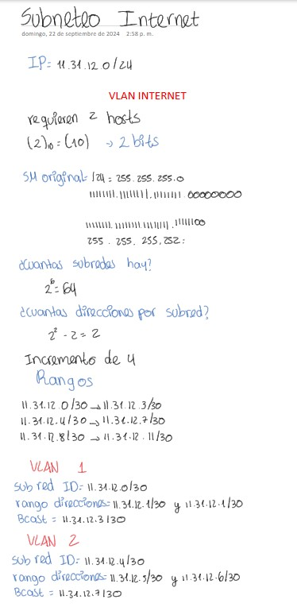

# DocumentacionLab2

## Miembros: Tomas Barrios Guevara, Valentina Ruiz Torres y Darek Aljuri Martínez

## 1. Introducción
En este laboratorio, se busca afianzar los conceptos fundamentales de redes, tales como LAN, WLAN, VLAN, IPv4 y Subneteo, a través de la construcción y configuración de una red SOHO en un entorno emulado con Cisco Packet Tracer. Se implementarán y configurarán servicios esenciales como DHCP, DNS y NAT, asegurando una eficiente asignación de direcciones IP. Asimismo, se establecerán protocolos de enrutamiento EIGRP u OSPF en las interfaces requeridas, permitiendo el correcto enrutamiento de paquetes IP a través de la red WAN. Además, se configurará un servidor HTTP para alojar contenidos web accesibles desde cualquier dispositivo dentro de la red. Durante el desarrollo del laboratorio, se simulará el flujo de datos y se analizará su comportamiento, garantizando que todos los servicios funcionen correctamente.
## 2. Topología de red

La topología mostrada es una red SOHO (Small Office Home Office) con interconexión a Internet y servidores remotos, los componentes principales de esta red son 

### Zona SOHO (en verde):
Incluye dispositivos de una oficina o hogar como PCs, laptops, tablets, impresoras, y un servidor local.
Hay varios PCs conectados por cable Ethernet, así como dispositivos móviles conectados a la red inalámbrica.
Está compuesta por switches (2960-24TT) y un Wireless LAN Controller (WLC) con un Access Point (LAP) para la red inalámbrica.

* Switches 2960-24TT: Según la página oficial de Cisco los Switches Cisco Catalyst 2960-24TT forman parte de la serie Cisco Catalyst 2960. Esta serie es una familia de switches de capa 2 diseñados para implementaciones en redes de pequeñas y medianas empresas, además cuentan con "24 y 48 puertos de conectividad Gigabit Ethernet (GbE) de escritorio 10/100/1000 " [1].
  
* Wireless LAN Controller: "Un controlador WLAN gestiona los puntos de acceso de red inalámbrica que permiten a los dispositivos inalámbricos conectarse a la red." [2]. Otra de sus funciones es centralizar la administración de la red Wi-Fi, lo que permite a los administradores gestionar configuraciones, políticas de seguridad y monitoreo de rendimiento de manera más eficiente.
  
*  Access Point (LAP): Un punto de acceso, es un dispositivo de red que permite la conexión de dispositivos inalámbricos a una red cableada. Actúa como un puente entre los dispositivos inalámbricos (como teléfonos, laptops y tabletas) y la red local (LAN). En este caso se usó un Lightweight Access Point (LAP) que es un punto de acceso (AP) que está diseñado para ser conectado a un controlador de red inalámbrica (WLC)." [3] Es decir que a diferencia de los Access point tradicionales los LAPs dependen de un controlador para gestionar su configuración, seguridad y operación.

### Interconexión WAN (en amarillo):

La topología muestra una conexión a Internet mediante routers (Cisco 2811) que representan diferentes puntos de conexión: ISP_BOG, ISP_NET, e ISP_TX.
Estos routers permiten la comunicación entre la red SOHO y servidores externos.

* El Cisco 2811 es un router de la serie 2800 de Cisco, diseñado principalmente para pequeñas y medianas empresas. Ofrece una combinación de funcionalidades de red y seguridad

### Zona de servidores (en azul):

Aquí se encuentran un servidor DNS y un servidor web, conectados a un switch (2960-24TT), que ofrece servicios externos.

## 3. Síntesis de la metodología y resultados de configuración: 
* **Montaje de la topología:** Utilizando el cableado estructurado y los modelos de dispositivos indicados (Switches Cisco 2960, Router Cisco 2811 (Routers a los cuales se les agrego el módulo WIC-2T para permitir conexiones seriales, es decir para poder conectar múltiples routers entre sí para poder similar la WAN del internet), WLC 3504 y LAP 3702i), se recreó la topología de red en Cisco Packet Tracer
  
  
  
 El cableado estructurado realizado se hizo siguiendo las indicaciones en clase y las lecturas. Todos los computadores fueron conectados a los patch panels A y B, para esto se conectaron los   punchdowns A al patch panel A y los punchdowns B y el patch panel B, esto por las normas impuestas dentro de las lecturas, siendo las A para la red_unisabana y las B para la red SOHO que se montó para este laboratorio. Se montaron dispositivos extras en nuevos racks y mesas para poder cumplir lo que pide el laboratorio y se utilizaron los 3 primeros switches del cableado para la topología del SOHO.

 Los patch panels de interconexión se conectaron por la parte de atrás para poder conectar dispositivos que se encontraban en distintos racks, un set de ocho para cada interconexión, se conectan en la parte de atrás para no tener cables entre racks en la parte de enfrente. 

  Se puede evidenciar el proceso del cableado realizado en la sala de computación. Solo 4 computadores están funcionando debido a que en la topología pedida para el laboratorio solo disponía de 4 computadores y como se reutilizo el primer switch se desconectaron los otros computadores a este para que no impidiera en conseguir la topología deseada.
  
* **Esquema de direccionamiento IPv4:** Se diseñó un esquema de direccionamiento basado en los requerimientos de las VLAN, asignando rangos de direcciones según la cantidad de dispositivos. Se realizó el Subneteo y se construyó una tabla de direccionamiento para toda la topología, teniendo en cuenta que las VLANs 20 y 40 requieren 1022 clientes cada una, mientras que las VLANs 99 y 55, requieren 254 clientes cada una y que la  zona de servidores  requiere 10 hosts

| |  | |
|:----------------------------------------------:|:---------------------------------------------------------:|:---------------------------------------------------------:|

* **Configuración de VLANs:** Se crearon y configuraron las 4 VLANs del SOHO y la VLAN de la zona de servidores según el esquema de direccionamiento diseñado. Se verificó la correcta creación y funcionamiento de estas mediante los siguientes comandos:
  * Para mostrar la configuración de VLANs en el switch:
      - ***show vlan brief***: Este comando muestra un resumen de todas las VLANs configuradas en el switch, incluyendo sus IDs y los puertos asignados.
        
| Switch red soho  | Descripción                                                                                                                                                                                                                                                                                                             |
|----------------------|-----------------------------------------------------------------------------------------------------------------------------------------------------------------------------------------------------------------------------------------------------------------------------------------------------------------------------|
|  | **VLAN Name**: Muestra el nombre de cada VLAN. Las VLANs identificadas son:  1: default,  20: Guest,  40: Internal,  55: Staff,  99: Native.    **Status**: Muestra el estado de cada VLAN, que en todos los casos aparece como   "active", lo que significa que están operativas.    **Ports**: Indica los puertos asignados a cada VLAN. Por ejemplo:  VLAN 1 (default) tiene asignados los puertos Fa0/6 a Fa0/9, Fa0/10 a Fa0/13,   Fa0/14 a Fa0/17, y otros hasta Gig0/2.  VLAN 20 (Guest) tiene asignado el puerto Fa0/4.  VLAN 40 (Internal) tiene asignado el puerto Fa0/3.  VLAN 55 (Staff) tiene asignado el puerto Fa0/5.  VLAN 99 (Native) no tiene puertos visibles asignados.  También se observan otras VLANs predeterminadas como 1002 (fddi-default),  1003 (token-ring-default),  1004 (fddinet-default),  y 1005 (trnet-default), todas en estado activo pero sin puertos asignados en este caso. |

| Switch red Servers  | Descripción                                                                                                                                                                                                                                                                                                             |
|-----------------------------------------------|-----------------------------------------------------------------------------------------------------------------------------------------------------------------------------------------------------------------------------------------------------------------------------------------------------------------------------|
|  | **VLAN Name**:VLAN Name: Muestra los nombres de las VLANs. En este caso, se observa la VLAN por defecto (VLAN 1) y otras VLANs predeterminadas (fddi-default, token-ring-default, fddinet-default, trnet-default), las cuales están activas aunque no suelen utilizarse en configuraciones actuales    Status: Indica el estado de la VLAN. Todas las VLANs en la salida están en estado "active".     Ports: Lista los puertos asociados a cada VLAN. Para la VLAN 1 (default), todos los puertos FastEthernet (Fa0/1 a Fa0/24) y dos puertos GigabitEthernet (Gig0/1 y Gig0/2) están asignados a esta VLAN. |

  * Para ver la configuración de interfaces:
      - ***show running-config | section interface:*** Este comando revela la configuración de las interfaces del dispositivo. Aquí se detallan las interfaces con configuraciones relacionadas con las VLANs, los puertos en modo acceso y los enlaces troncales. Por esta razón el comando solo se va a usar en la red SOHO donde hay VLANS asignadas
  
  - Enlaces troncales: Los puertos Fa0/1, Fa0/2, y Gi0/1 están configurados como troncales, transportando múltiples VLANs, lo cual es típico en una red donde se requiere que varias VLANs pasen por una única interfaz entre switches o entre un switch y un router.
  - Puertos de acceso: Los puertos Fa0/3, Fa0/4 y Fa0/5 están configurados en modo acceso, cada uno vinculado a una VLAN específica (40, 20 y 55 respectivamente), lo que los conecta a dispositivos que solo necesitan pertenecer a una única VLAN.
  - VLANs: Se tienen varias interfaces VLAN configuradas con direcciones IP específicas, lo que podría indicar que el switch está actuando como un router de capa 3, o que se están utilizando estas VLANs para enrutar tráfico entre diferentes segmentos de red.
    
| Switch red soho  | Descripción                                                                                                                                                                                                                                                                                                             |
|----------------------|-----------------------------------------------------------------------------------------------------------------------------------------------------------------------------------------------------------------------------------------------------------------------------------------------------------------------------|
|  | ***Interface FastEthernet0/1:***   **switchport trunk native vlan 99:** Configura la VLAN nativa del troncal como la VLAN 99. Esto significa que el tráfico no etiquetado será asignado a esta VLAN   **switchport trunk allowed vlan 20,40,55,99:** Permite que las VLANs 20, 40, 55 y 99 puedan pasar por esta interfaz en modo troncal.   **switchport mode trunk:** Configura el puerto en modo troncal, lo que significa que puede transportar tráfico de múltiples VLANs.    ***Interface FastEthernet0/2:*** Tiene la misma configuración que FastEthernet0/1: es una interfaz en modo troncal que permite las VLANs 20, 40, 55 y 99, con la VLAN nativa configurada como 99.  ***Interfaces FastEthernet0/3 y FastEthernet0/4:***  **switchport access vlan 40 (en Fa0/3) y switchport access vlan 20 (en Fa0/4):** Estas interfaces están configuradas en modo acceso, lo que significa que pertenecen a una sola VLAN (40 o 20, respectivamente) y cualquier tráfico en estos puertos será etiquetado para la VLAN correspondiente.    ***Interface FastEthernet0/5:***  **switchport access vlan 55:** Está configurada como un puerto de acceso para la VLAN 55.    **Interfaces FastEthernet0/6 a FastEthernet0/24:** Estas interfaces no tienen configuraciones adicionales especificadas, por lo que probablemente estén en su configuración predeterminada, o no están activas.   **Interfaces GigabitEthernet0/1 y GigabitEthernet0/2:** *GigabitEthernet0/1* tiene una configuración similar a Fa0/1 y Fa0/2, en modo troncal, permitiendo las VLANs 20, 40, 55 y 99, con la VLAN 99 como VLAN nativa y *GigabitEthernet0/2* no tiene configuraciones específicas aparte de estar en modo troncal.   ***Interfaces de VLAN:***   **interface Vlan20:** Asignada a la dirección *IP 172.23.0.3* con la máscara de red 255.255.255.0.  **interface Vlan40:** Asignada a la dirección *IP 172.23.4.3* con la máscara 255.255.255.0.  **interface Vlan55:** Asignada a la dirección *IP 172.23.8.3* con la misma máscara 255.255.255.0.  **interface Vlan99:** Asignada a la dirección IP *172.23.9.3* con una máscara de 255.255.255.0. |

* **Configuración de dispositivos:** Se aplicaron configuraciones básicas a los switches y router, como la asignación de direcciones IP a las interfaces dependiendo del Subneteo realizado anteriormente y configuración de servicios como DHCP, DNS y NAT. Además, se configuró el WLC y el LAP (punto de acceso inalámbrico) para la red WLAN. La documentación de los routers y switches están en un **archivo .txt adjunto** en el repositorio en la carpeta config y en la tarea en teams.

* **Asignación y verificación de IPs:** Se verificó que las direcciones IP fueran asignadas correctamente a todos los dispositivos de la red. Se utilizaron comandos TCP/IP para comprobar la conectividad entre los nodos.
  * **¿Se requiere asignación dinámica y/o estática? ¿Dónde? ¿Traducción de direcciones de forma dinámica y/o estático y/o por puertos? ¿En qué terminales se deben configurar los servicios requeridos?**
   * configuración de **NAT**:
     1.  ***Conservación de direcciones IP:*** En una red SOHO como la que se tiene, los dispositivos internos usan direcciones IP privadas (la red  SOHO usa  172.23.0.0), que no son válidas en Internet. NAT actúa como un traductor entre direcciones públicas y privadas para que así, desde la soho que tiene una dirección pública se pueda acceder al internet y posteriormente a la red de servidores, que ambos son públicos. En este caso se usó PAT (Port Address Translation), "que es una extensión a la traducción de direcciones de red (NAT), que permite que varios dispositivos en una red de área local (LAN) se puedan asignar a una sola dirección IP publica" [5].
        - ¿Por Qué PAT?
          
            En la topología, donde hay varios dispositivos en la red SOHO (172.23.0.0/16) que necesitan acceder a Internet, PAT es una excelente solución porque permite que todos los dispositivos de la red SOHO utilicen una sola dirección IP pública (o un pequeño rango de IPs públicas) para acceder a Internet. Los dispositivos compartirán la dirección IP pública del router de la zona de interconexión WAN (11.31.12.0) cuando se conecten a Internet. En la topología el servicio de PAT está configurado en el router de la red WAN (Cisco 2811), que traduce las direcciones IP privadas de la red SOHO a la dirección IP pública utilizada para acceder a Internet."

        - ¿Cómo funciona PAT?
          
          *Dirección IP compartida*: Todos los dispositivos dentro de tu red SOHO (PCs, smartphones, tablets, etc.) envían tráfico a Internet utilizando direcciones IP privadas (como 172.23.x.x). El router que tiene configurado NAT/PAT traduce todas estas direcciones IP           privadas a una única dirección IP pública asignada a la interfaz de salida del router (hacia Internet).

          *Asignación de puertos:* Para diferenciar el tráfico de cada dispositivo dentro de la red, el router cambia los números de puerto en los encabezados de los paquetes TCP/UDP. Esto permite que muchos dispositivos compartan una única dirección IP pública, ya que           cada conexión queda identificada por una combinación de la dirección IP pública y el puerto único asignado a cada dispositivo.
          
     2.  ***Interconexión WAN:*** En la topología, se están utilizando routers para conectar varios dispositivos a la red del ISP. NAT permite que los routers gestionen múltiples conexiones internas hacia el exterior sin conflictos de dirección IP, facilitando la conectividad hacia servicios externos, como los servidores en la zona azul.
    
     3.  ***Seguridad:*** NAT actúa como una capa de protección, ya que oculta las direcciones IP internas de la red SOHO. Esto significa que desde el exterior (Internet) no se puede acceder directamente a las máquinas en la red interna sin una configuración explícita.

  * Configuración de **DHCP**, asignación **Dinámica**  
    
    Se usa DHCP en la red SOHO y no en las otras redes debido a las diferentes necesidades de cada zona:
    
    1. ***Red SOHO (172.23.0.0):***
              
       La red SOHO está compuesta por dispositivos como PCs, laptops, tablets, impresoras y otros dispositivos que pertenecen a un entorno de oficina o hogar. Este está configurado en el Server 0, es un servidor que asigna direcciones IP automáticamente a los dispositivos, esto se hace por las siguientes razones :
         
       - Facilidad y Flexibilidad: Los dispositivos que entran y salen de la red con frecuencia, como tablets, smartphones o laptops, necesitan una forma flexible de obtener una dirección IP sin tener que                configurarla manualmente. DHCP facilita esto, ya que asigna direcciones IP dinámicamente sin intervención del usuario.
       - Configuración Centralizada: El servidor DHCP en la red SOHO centraliza la asignación de IPs, DNS y puerta de enlace predeterminada, lo que hace que la administración sea más simple y eficiente para los          administradores de la red.
       - Escalabilidad: Al tener varios dispositivos que pueden conectarse o desconectarse con regularidad, DHCP asegura que las direcciones IP se asignen y liberen automáticamente, evitando la necesidad de             asignarlas manualmente cada vez.

        

  * Asignación **Estática**
    
    2. ***Red de Servidores (161.130.8.0):***
              
       En la zona de servidores, los dispositivos como el servidor DNS y el servidor web necesitan tener direcciones IP fijas o estáticas:
         
       - Consistencia y Accesibilidad: Los servidores  deben tener direcciones IP fijas para que puedan ser accesibles desde cualquier parte de la red y desde Internet. Las aplicaciones y servicios que dependen       de ellos necesitan saber siempre cuál es su dirección IP.
       - Configuraciones Manuales: Los servidores requieren configuraciones manuales más específicas y detalladas que las que proporciona DHCP. Además, el uso de IPs estáticas asegura que los servidores no           cambien de dirección IP, lo que es crucial para el funcionamiento de servicios de red como DNS o servidores web.

    3. ***Red de Interconexión WAN (11.31.12.0)::***
              
       La red WAN conecta tu red local a Internet mediante routers Cisco 2811 y otros dispositivos de interconexión. En este caso:
         
       - Routers y Gateways: Los routers y otros dispositivos de interconexión también necesitan direcciones IP fijas para garantizar una conexión estable con otras redes externas. Usar direcciones estáticas en esta zona asegura que los routers mantengan la misma IP pública, lo cual es esencial para la comunicación con el ISP y otros routers en la WAN.
       - Tráfico Estable: En una WAN, los dispositivos y routers generalmente no cambian con frecuencia, por lo que no es necesario utilizar DHCP. Al tener direcciones fijas, se garantiza una gestión más controlada y predecible del tráfico de red hacia y desde Internet.

* **Pruebas de conectividad:** Se realizaron pruebas de conectividad entre dispositivos de la misma VLAN y entre diferentes VLANs, utilizando comandos como ping. También se comprobó la conectividad con las puertas de enlace y otros servicios:
  1. Prueba de comunicación entre dispositivos conectados en la VLAN 40 (PC1 a PC2)
     
      

  2. Prueba de comunicación entre dispositivos conectados en diferentes VLANs en este caso de la 40 a la 55. desde el PC2 hasta Printer0
     
     

  3. ***Show interface trunk***, que muestra qué puertos están configurados como trunks y qué VLANs están permitidas en esos puertos.
     
     

  4. Conectividad entre el Switch dos y el LAP(access point). Se tiene una tasa de éxito del 100% en el ping hacia 172.23.9.4, lo que significa que la conectividad entre switch2 (IP 172.23.9.3) y el LAP está funcionando perfectamente.
      
      

  5. Conectividad entre diferentes redes, Desde PC1(SOHO) hasta el servidor web (Servers)
     
     

  6. Conectividad entre Red soho a default Gateway de red servidores
     
      

 

  * **Se encontraron diversos problemas al momento de probar la comunicación entre dispositivos y VLANs:**

    1. El primer problema lo encontramos al intentar comunicar diferentes VLANs en la red SOHO, ya que al hacer ping nunca     recibíamos una respuesta. Tras revisar la configuración de las VLANs, descubrimos que las direcciones IP no estaban        bien asignadas, lo que causaba el fallo de conectividad. Para resolverlo, ajustamos la configuración de las IPs en         cada dispositivo dentro de las VLANs afectadas. La solución completa se puede ver en las fotos incluidas en los            puntos i y ii.

    2. Otro de los problemas que enfrentamos fue con la conectividad del WLC (Wireless LAN Controller). Inicialmente, no       se podía conectar. La solución fue ingresar al servidor y asignarle la IP correspondiente al WLC. Luego, en el WLC,        tuvimos que verificar los puertos y asegurarnos de que el puerto que estaba conectado al switch coincidiera con la         configuración del WLC. El problema radicaba en que el WLC había sido configurado desde una computadora que solo            manejaba la VLAN 20. Uno de los puertos debía coincidir con el puerto donde el switch estaba conectado, pero no lo         habíamos configurado correctamente.

    Una vez solucionamos el problema del puerto, la conectividad seguía sin funcionar. Nos dimos cuenta de que el problema     era que, al crear la configuración, se había generado automáticamente una VLAN de administración, que es la que asigna     la IP al LAP (Lightweight Access Point). Al hacer el cambio, no habíamos ajustado correctamente la VLAN de                 administración, lo que causaba el fallo. Tras corregir esto, el WLC comenzó a funcionar correctamente.

       - **Paso a paso de la solución**
   
           - ***Acceder al WLC y verificar la configuración:*** Conectarse al WLC mediante su IP desde un navegador o un cliente de administración, y desde ahí, Asegurarse de que el WLC esté configurado correctamente con las VLAN correspondientes. Además  se debe verificar que el puerto del WLC que está conectado al switch coincida con el puerto configurado en la interfaz del switch.
             
             
    Como se puede ver en la imagen la **dirección Ip** del WLC es 172.23.9.2 y su **Default Gateway** es 172.23.9.1, cabe resaltar que la dirección IP debe ser estática, si se usa DCHP la dirección cambia e interrumpe la comunicación con el LAP  
            
           - ***Verificar la VLAN de administración***: Desde el WLC, Asegurarse de que la VLAN de management esté activa y sea la que asigna las IPs al LAP (Lightweight Access Point). En la pestaña de config del LAP en Global dice WLC, la dirección que va en Controller desde ser la dirección Ip del WLC para que la comunicación sea efectiva.
    
    

          -***Verificar el DCP en los dispositivos inalámbricos conectados al LAP:*** desde la Tablet PC0, la Laptop0 o el Smartphone0 revisar la  dirección IP asignada por el DHCP y si coincide con la VLAN en la que debería estar

     

    
* **Verificación del protocolo STP:** Se verificó que el protocolo STP estuviera correctamente configurado para evitar bucles, y se comprobó cuál de los switches fue seleccionado como puente raíz.

    * Para hacer la verificación se utiliza el comando **show spanning-tree** que muestra información como La configuración de STP, las VLANs para las cuales está activo, el estado de los puertos (puerto raíz, puerto designado, etc.), el tiempo de convergencia y otros parámetros relevantes
    
    * la salida del comando show spanning-tree muestra que el switch actual (sw1_Intranet) es el puente raíz para varias VLANs
      
      
  

      * Información General de VLANs:
      La salida muestra información sobre varias VLANs (VLAN0020, VLAN0040, VLAN0055 y VLAN0099), y cada una tiene configurado el protocolo STP. A continuación se presenta un desglose de cada sección:

         1. ***Root ID:***
         
            - Priority: Indica la prioridad del puente raíz (Root Bridge) de la VLAN. La prioridad más baja gana, por lo que aquí se puede observar que el puente raíz tiene diferentes prioridades para cada VLAN (32788 para VLAN0020, 32808 para VLAN0040, etc.).
            - Address: Muestra la dirección MAC del puente raíz, que en este caso es 0001.4217.5157. Este switch es el puente raíz para todas las VLANs listadas, ya que en cada caso se indica "This bridge is the root".
        
        2. ***Bridge ID:***
            - También incluye la dirección MAC del switch actual y la prioridad del puente. La salida indica que el switch actual es también el puente raíz para las VLANs, como se muestra en las prioridades.
        
        3. ***Parámetros de STP:***
            - Hello Time: 2 segundos, el intervalo entre los mensajes Hello enviados por el puente raíz para mantener la topología.
            - Max Age: 20 segundos, el tiempo que un switch mantiene información de la topología antes de considerarla obsoleta.
            - Forward Delay: 15 segundos, el tiempo que un puerto permanece en estado de escucha antes de poder comenzar a enviar tráfico.

        4. ***Estado de los Puertos:***
            - Cada VLAN muestra una tabla con la información de los puertos:
            - Interface: El puerto del switch (por ejemplo, Fa0/1, Fa0/23, etc.).
            - Role: Indica si el puerto es Designado (Desg) o Raíz (Root). Todos los puertos listados son Designados (Desg), lo que significa que están activos y pueden enviar y recibir tráfico.
            - Sts: Estado del puerto (FWD indica que el puerto está en modo de reenvío).
            - Cost: Costo asociado al puerto. Los costos más bajos son preferidos en la selección de caminos hacia el puente raíz.
            - Prio.Nbr: La prioridad del puerto y su número (por ejemplo, 128.1 para Fa0/1).
            - Type: Indica el tipo de conexión (en este caso, P2p, que significa punto a punto).

            
  * Para verificar si es posible hacer Telnet desde un PC a otros switches y a un router (como R_SOHO) se utiliza el siguiente comando en la línea de comandos (CMD) del PC, **telnet <dirección IP>**, cabe resaltar que "Telnet es el nombre de un protocolo de red que permite acceder a otra máquina para manejarla remotamente como si estuviéramos sentados delante de ella" [6].
    - **Configuración paso a paso**
      - Paso 1: Configurar el Dispositivo de Destino
        
           - Accede al Dispositivo: El router (R_SOHO) o los switches a los que se va a conectar deben tener configurado un nombre de usuario y una contraseña para Telnet. Esto se hace desde la CLI del dispositivo:
             
                   configure terminal
             
                   line vty 0 4
             
                   login local
             
                   transport input telnet
             
                   username admin password cisco
    
      - Paso 2: Configurar el PC
        
           - Seleccionar el PC desde el que se va a hacer Telnet, en este caso desde el PC1.
           - Acceder a la Consola del PC: Seleccionar la pestaña Desktop y luego hacer clic en Command Prompt
           - Ejecutar el Comando de Telnet: En el símbolo del sistema del PC, se debe escribir el siguiente comando, reemplazando <dirección IP> por la dirección IP del dispositivo al que se va a conectar (por ejemplo, la dirección IP del router R_SOHO ):
             
                   telnet 200.190.7.1
             
                   username:admin
             
                   password: cisco

       - Paso 3: revisar resultado, si aparece el prompt del dispositivo al que se quería acceder entonces fue exitoso. Esto se puede probar en toda la red SOHO
    
        

* **Configuración de enrutamiento:** Se configuraron los protocolos de enrutamiento  EIGRP en las interfaces necesarias, verificando el correcto enrutamiento de paquetes entre las redes LAN y WAN.

  - El uso de EIGRP (Enhanced Interior Gateway Routing Protocol) en la topología de red se debe a varias razones clave, especialmente en el contexto de su funcionalidad y ventajas. Aquí se detallan algunas de las principales razones para utilizar EIGRP:

      - Mejoras sobre RIP: EIGRP es un protocolo de enrutamiento híbrido que combina características de enrutamiento de distancia y de estado, lo que le permite superar las limitaciones de RIP (Routing Information Protocol).
      - Convergencia Rápida: EIGRP tiene tiempos de convergencia más rápidos en comparación con otros protocolos de enrutamiento, lo que significa que puede adaptarse más rápidamente a los cambios en la topología de la red. Esto es crítico en entornos donde la disponibilidad y la estabilidad son esenciales.
      - Métricas Compuestas: EIGRP utiliza una métrica compuesta que incluye ancho de banda, retardo, carga y confiabilidad. Esta flexibilidad permite a los administradores de red influir en la selección de rutas basándose en múltiples criterios, en lugar de depender de un único parámetro. [7]
      - Máscaras de Subred Variable (VLSM): EIGRP es compatible con VLSM, lo que permite la implementación de subredes de diferentes tamaños en una misma red. En esta topología fue necesario hacer Subneteo VLSM
      - Classless Inter-Domain Routing (CIDR): Permite la implementación de rutas sin clases, lo que optimiza el uso de direcciones IP.
      - Configuración Sencilla: EIGRP es relativamente fácil de configurar en comparación con otros protocolos, lo que puede ahorrar tiempo y reducir la complejidad administrativa.

    **Configuración del EIGRP**

       
    
  - **Paso a paso en la red SOHO**
 
      - Acceder al modo de configuración global:
        
                        router> enable
                        router# configure terminal

      - Habilitar EIGRP: El proceso se inicia con un número de sistema autónomo (AS).
        
                        router(config)# router eigrp 1
 
      - Configurar las redes: se deben añadir las redes para que EIGRP las anuncie. es muy importante asegurarse de usar las máscaras de subred correctas según la configuración. Aquí se usan las IPs de las VLANS de todos los espacios de red o sistemas autónomos que se tienen
   
                        router(config-router)# network 172.23.0.0 0.0.3.255
                        router(config-router)# network 172.23.4.0 0.0.3.255
                        router(config-router)# network 172.23.8.0 0.0.0.255
                        router(config-router)# network 172.23.9.0 0.0.0.255
                        router(config-router)# network 200.190.7.0 0.0.0.255

      - Salir del modo de configuración de EIGRP:
   
                        router(config-router)# exit

    

    **Pruebas del funcionamiento de EIGRP**
    
    

    A continuación, se proporciona una descripción y explicación del funcionamiento de los comandos utilizados para            verificar la configuración de EIGRP en el router R_SOHO, así como sus resultados.

    ***1. Configuración de EIGRP***
       
              router1#show running-config | section router eigrp
        
              router eigrp 1
    
              network 172.23.0.0 0.0.3.255
        
              network 172.23.4.0 0.0.3.255
        
              network 172.23.8.0 0.0.0.255
        
              network 172.23.9.0 0.0.0.255
        
              network 200.190.7.0
      - **Descripción:**
      - router eigrp 1: Indica que el proceso EIGRP está configurado para el número de sistema autónomo (AS) 1.
      - network: Estas líneas especifican las redes que EIGRP debe anunciar y escuchar. La máscara invertida (wildcard mask) se utiliza para definir las subredes que se incluyen en el proceso EIGRP.
      - 0.0.3.255 significa que se incluyen todas las direcciones en las dos últimas posiciones de la dirección, permitiendo que las interfaces con direcciones IP en el rango de 172.23.0.0 a 172.23.3.255 se incluyan en el proceso EIGRP.
      - 0.0.0.255 indica que solo se incluye una dirección IP específica.

     ***2. Interfaces EIGRP Activas***
         

              router1#show ip eigrp interfaces
              IP-EIGRP interfaces for process 1
              
                                      Xmit Queue   Mean   Pacing Time   Multicast    Pending
              Interface        Peers  Un/Reliable  SRTT   Un/Reliable   Flow Timer   Routes
              Fa0/0.20           0        0/0      1236       0/10           0           0
              Fa0/0.40           0        0/0      1236       0/10           0           0
              Fa0/0.55           0        0/0      1236       0/10           0           0
              Fa0/0.99           0        0/0      1236       0/10           0           0
              Se0/3/0            1        0/0      1236       0/10           0           0

     - **Descripción:**
     - Interfaz: Muestra las interfaces en las que EIGRP está habilitado.
     - Peers: Indica el número de vecinos EIGRP en la interfaz.
     - SRTT (Smooth Round Trip Time): El tiempo promedio que toma un paquete para ir y volver entre el router y su vecino, en milisegundos.
     - Un/Reliable: Muestra los contadores de paquetes no confiables y confiables.
     - Multicast Flow Timer: Tiempo de espera para la siguiente transmisión multicast.
     - Pending Routes: Número de rutas pendientes en la cola de transmisión.
   
    ***3. Rutas Aprendidas por EIGRP***

              router1#show ip route eigrp
                   11.0.0.0/30 is subnetted, 3 subnets
              D       11.31.12.0 [90/2681856] via 200.190.7.2, 00:30:33, Serial0/3/0
              D       11.31.12.4 [90/3193856] via 200.190.7.2, 00:30:33, Serial0/3/0
              D       11.31.12.8 [90/3705856] via 200.190.7.2, 00:30:33, Serial0/3/0
                   161.130.0.0/28 is subnetted, 1 subnets
              D       161.130.8.0 [90/3708416] via 200.190.7.2, 00:30:33, Serial0/3/0

    - **Descripción:**
    - D: Indica que la ruta es aprendida a través de EIGRP.
    - [90/2681856]: 90 es la métrica de confianza de EIGRP y 2681856 es el costo total de la ruta.
    - via 200.190.7.2: La dirección IP del siguiente salto para llegar a la red.
    - Serial0/3/0: La interfaz a través de la cual se accede al siguiente salto.
   
      ***4. Vecinos de EIGRP***
            
            router1#show ip eigrp neighbors
            IP-EIGRP neighbors for process 1
            H   Address         Interface      Hold Uptime    SRTT   RTO   Q   Seq
                                               (sec)          (ms)        Cnt  Num
            0   200.190.7.2     Se0/3/0        10   00:30:44  40     1000  0   17

    - **Descripción:**
    - H: Número de vecino.
    - Address: Dirección IP del vecino.
    - Interface: La interfaz del router que conecta con el vecino.
    - Hold: Tiempo restante para que se mantenga la relación con el vecino.
    - Uptime: Tiempo que el vecino ha estado activo.
    - SRTT: Tiempo promedio de ida y vuelta con el vecino.
    - RTO: Tiempo de espera para retransmitir paquetes.
    - Q Count: Número de paquetes en cola para el vecino.
    - Seq Num: Número de secuencia de los paquetes EIGRP.
   
      ***5. Tabla de Topología de EIGRP***
                
                router1#show ip eigrp topology
                IP-EIGRP Topology Table for AS 1/ID(200.190.7.1)
                
                Codes: P - Passive, A - Active, U - Update, Q - Query, R - Reply,
                       r - Reply status
                
                P 11.31.12.0/30, 1 successors, FD is 2681856
                         via 200.190.7.2 (2681856/2169856), Serial0/3/0
                P 11.31.12.4/30, 1 successors, FD is 3193856
                         via 200.190.7.2 (3193856/2681856), Serial0/3/0
                P 11.31.12.8/30, 1 successors, FD is 3705856
                         via 200.190.7.2 (3705856/3193856), Serial0/3/0
                P 161.130.8.0/28, 1 successors, FD is 3708416
                         via 200.190.7.2 (3708416/3196416), Serial0/3/0
                P 172.23.0.0/22, 1 successors, FD is 28160
                         via Connected, FastEthernet0/0.20
                P 172.23.4.0/22, 1 successors, FD is 28160
                         via Connected, FastEthernet0/0.40
                P 172.23.8.0/24, 1 successors, FD is 28160
                         via Connected, FastEthernet0/0.55
                P 172.23.9.0/24, 1 successors, FD is 28160
                         via Connected, FastEthernet0/0.99
                P 200.190.7.0/24, 1 successors, FD is 2169856
                         via Connected, Serial0/3/0

      - **Descripción:**
      - P: Indica que la ruta es pasiva y está disponible para su uso.
      - FD (Feasible Distance): Métrica total para alcanzar una ruta.
      - Successors: Número de rutas sucesoras disponibles para la red especificada.
      - via: Indica el siguiente salto y la interfaz a través de la cual se puede acceder a esa red.
        

     
 **Pruebas del funcionamiento de EIGRP R_servers**
    
   

   La diferencia principal entre esta configuración y el paso a paso demostrado anteriormente para la SOHO es en la primera parte donde se ponen las direcciones IP, pues acá se ponen las VLANS correspondientes a la red de servidores
    
 **Pruebas del funcionamiento de EIGRP ISP_bog**
 
   
   
   La diferencia principal entre esta configuración y el paso a paso demostrado anteriormente para la SOHO es en la primera parte donde se ponen las direcciones IP, pues acá se ponen las VLANS correspondientes a la red de INTERNET
 
* **Pruebas de servicios web:** Se configuró un servidor HTTP y se verificó que todos los usuarios pudieran acceder a la página web personalizada (dvt.net) desde cualquier dispositivo de la red, utilizando el dominio gestionado por el servidor DNS.
  
  * configuración de **DNS**
      - Configurar el Servidor DNS
      - Seleccionar el Servidor: se hace clic en el servidor  para abrir la ventana de configuración.
      - Ir a la Pestaña Config: En la ventana del servidor, selecciona la pestaña "Config" (Configuración).
      - Activar el Servicio DNS: En el panel izquierdo, se hace clic en "DNS" y se habilita el servicio DNS. Esto teniendo en cuenta que la Ip del servidor es estática, la pusimos nosotros
      - Agregar Entradas DNS:
      - En el campo "Name", se ingresa el nombre del dominio (dvt.net).
      - En el campo "IP Address", se ingresa la dirección IP correspondiente (161.130.8.2).
      -  Se hace clic en "Add" para agregar la entrada.
 
  El sistema DNS se encargó de resolver el nombre de dominio "dvt.net" a su respectiva dirección IP. Esto fue crucial para que los dispositivos pudieran comunicarse con el servidor web  de manera transparente para los usuarios. [8]
  
  * **prueba funcionamiento  servidor web**

   
   

Para garantizar que las conexiones HTTP se realizaran desde el puerto 80 se programó en el js de la página web:
                              
                    // Configurar la ruta principal "/"
                    HTTPServer.route("/", function(url, res) {
                        console.log("Solicitud recibida para /");
                
                        // Respuesta HTML simple
                        var htmlContent = "<!DOCTYPE html>" +
                            "<html lang='es'>" +
                            "<head>" +
                            "<meta charset='UTF-8'>" +
                            "<title>dvt.net</title>" +
                            "" +
                            "</head>" +
                            "<body>" +
                            "<h1>dvt.net</h1>" +
                            "
Darek Aljuri, Valentina Ruiz, Tomás Barrios
" +
                            "</body>" +
                            "</html>";
                            
                        // Enviar la respuesta HTML
                        res.send(htmlContent);
                    });
                
                    // Iniciar el servidor en el puerto 80
                    HTTPServer.start(80);
                
                    console.log("Servidor iniciado en el puerto 80");

  

## 4. Puntos solicitados en la sección de Resultados y Análisis

1)  ***Diseño estructurado SOHO***
    - **¿Cuántas subredes necesitas?**
      
      -Necesitamos 4 subredes, una para cada VLAN (20, 40, 99 y 55).
    
    - **¿Qué dispositivos/interfaces son parte de una subred dada?**
        - Cada subred incluirá los dispositivos asignados a las VLANs específicas:
          - VLAN 20: Dispositivos de Guest
          - VLAN 40: Dispositivos de Internal
          - VLAN 99: Dispositivos de Native
          - VLAN 55: Dispositivos de Staff
          
    - **¿Cuántos dispositivos/hosts requiere la subred?**
        - VLAN 20: 1022 hosts
        - VLAN 40: 1022 hosts
        - VLAN 99: 254 hosts
        - VLAN 55: 254 hosts
          
    - **¿Qué partes de tu red usan direcciones privadas y cuáles usan públicas?**
      
        - La red SOHO usa direcciones privadas dentro del rango 172.23.0.0/16.
  
    - **¿Dónde deberían conservarse las direcciones?**
      
        - Las direcciones deben conservarse en las subredes que requieren menos hosts, como las VLANs 99 y 55.
   
 2) ***Diseño estructurado INTERNET***
    - **¿Cuántas subredes necesitas?**
      
      -Necesitamos 2 subredes, una para cada VLAN (1 y 2).
    
    - **¿Qué dispositivos/interfaces son parte de una subred dada?**
        - Cada subred incluirá los dispositivos asignados a las VLANs específicas:
          - VLAN 1: ISP_BOGOTA tiene la interfaz serial 0/3/1, ISP_NET tiene la interfaz serial 0/3/0
          - VLAN 2:  ISP_NET tiene la interfaz serial 0/3/1, ISP_TX tiene la interfaz 0/3/0
          
          
    - **¿Cuántos dispositivos/hosts requiere la subred?**
       Ambas VLAN requieren 2 hosts
          
    - **¿Qué partes de tu red usan direcciones privadas y cuáles usan públicas?**
      
        - La red requiere direcciones publicas ya que es una WAN y es el ISP, dentro del rango 11.31.12.0

3) ***Diseño estructurado SERVIDORES***
    - **¿Cuántas subredes necesitas?**
      
      -Necesitamos 1 subred.
  
      - **¿Cuántos dispositivos/hosts requiere la subred?**
        Requiere 10 hosts
          
    - **¿Qué dispositivos/interfaces son parte de una subred dada?**
       Los dos servidores y el router serán parte de la subred
          
          
    - **¿Qué partes de tu red usan direcciones privadas y cuáles usan públicas?**
      
        - La red de servidores usa direcciones publicas dentro del rango 161.130.8.0.

**Subneteo y su tabla**

   

**Tabla de direccionamiento de red**

   

4) ***análisis y proceso de configuración de los servicios de red requeridos para el correcto funcionamiento de la red empresarial.***

- Identificación de los Servicios y protocolos necesarios:
    - VLANs (Virtual Local Area Network):
        - Segmentación lógica de la red en subredes.
        - Se configuraron para separar el tráfico entre dispositivos.
          
- STP (Spanning Tree Protocol):
    - Protocolo para evitar bucles en la red de switches y seleccionar un Root Bridge.
- DNS (Domain Name System):
    - Protocolo para traducir nombres de dominio a direcciones IP.
    - Configuración del servidor DNS para gestionar el nombre de dominio (dvt.net).
- DHCP (Dynamic Host Configuration Protocol):
    - Protocolo para asignar dinámicamente direcciones IP a los dispositivos finales (PCs, móviles).
      
- NAT (Network Address Translation):
    - Traducción de direcciones IP privadas a una dirección pública para permitir el acceso a Internet.
    - Configuración de PAT.
      
- HTTP/HTTPS (HyperText Transfer Protocol / Secure):
    - Protocolo para acceder a la página web personalizada alojada en el servidor web.
    - Conexiones realizadas desde el puerto 80 (HTTP).
      
- Telnet:
    - Protocolo para acceder remotamente a los routers y switches mediante administración remota.
      
- EIGRP (Enhanced Interior Gateway Routing Protocol) o OSPF (Open Shortest Path First):
    - Protocolo de enrutamiento dinámico configurado en las interfaces necesarias para permitir la comunicación entre diferentes subredes.
      
- TCP/IP (Transmission Control Protocol / Internet Protocol):
    - Protocolo principal de comunicación en la red. Utilizado para verificar conectividad entre dispositivos con comandos como ping o traceroute. [9]
      
- WLC (Wireless LAN Controller) y LAP (Lightweight Access Point):
    - Controlador y puntos de acceso ligeros para gestionar la red inalámbrica (WLAN) de forma centralizada.

5) ***Evaluación del flujo bidireccional de datos generado al acceder a la página alojada en el servidor Web por los nodos terminales (PCs y dispositivos móviles) de las diferentes VLANs que conforman la topología, utilizando el servicio DNS***
   
Anteriormente se han presentado pruebas que demuestran el correcto funcionamiento de la conectividad entre los nodos terminales, el acceso al servidor web y la resolución de nombres mediante DNS. A continuación, se procederá con el análisis detallado del tráfico de red, utilizando capturas de paquetes para verificar el flujo bidireccional de datos y asegurar el correcto enrutamiento y procesamiento de solicitudes en la red:

**Descripción de la secuencia de comunicación:**
PC1 usa DNS para resolver el nombre de dominio del Web_Server a su dirección IP.
STP asegura que no haya bucles en la red mientras los switches gestionan la topología de red.
EIGRP permite a los routers identificar las mejores rutas para enviar paquetes entre PC1 y el Web_Server.
TCP establece una conexión confiable entre PC1 y el Web_Server para garantizar que los datos se transfieran de manera ordenada y sin errores.
HTTP es utilizado por PC1 para solicitar y recibir contenido web desde el Web_Server.

   
   
En la imagen se muestra el proceso de resolución de DNS para un cliente (PC1) que está realizando una consulta de DNS hacia un servidor DNS. Aquí está el análisis de lo que está ocurriendo:

- ***Proceso inicial:***

El dispositivo PC1 está enviando una consulta DNS para resolver un nombre de dominio a una dirección IP. La consulta utiliza el puerto de origen 1026 y está dirigida al puerto 53 (el puerto estándar de DNS).
La dirección IP de origen es 172.23.0.6 (correspondiente a PC1) y la de destino es 161.130.8.2 (correspondiente al servidor DNS).
La capa de enlace muestra que el paquete está viajando sobre FastEthernet.
Evento principal:

A la derecha se puede ver una lista de eventos que detalla cómo los paquetes están viajando a través de la red, pasando por varios dispositivos intermedios. Entre los dispositivos involucrados están los switches, routers, y paneles de interconexión.
Hay una gran cantidad de eventos DNS, lo que indica que esta consulta está siendo enrutada a través de varias partes de la red, posiblemente por el backbone o la WAN, hacia el servidor DNS.
Dispositivos importantes:

Se pueden observar routers como el R_SOHO y dispositivos ISP involucrados en el enrutamiento de los paquetes.
El servidor web parece estar en una DMZ (SW_DMZ), lo cual es una zona desmilitarizada para alojar servicios accesibles desde fuera de la red interna.
La ruta de los paquetes incluye segmentos que usan EIGRP como protocolo de enrutamiento, lo cual facilita la ruta hacia el servidor DNS y el servidor web.
Protocolo de enrutamiento EIGRP:

En algunos puntos de la ruta (por ejemplo, ISP_TX), se está utilizando el protocolo de enrutamiento EIGRP, lo cual permite la selección de la mejor ruta entre las posibles para llegar al servidor DNS.

- ***Resumen:***
Lo que está ocurriendo aquí es una consulta de DNS iniciada por PC1. Esta consulta pasa a través de varios dispositivos de red, como switches, routers y dispositivos de interconexión, utilizando el protocolo EIGRP en algunos saltos para facilitar el enrutamiento. El objetivo final es que el servidor DNS resuelva la consulta y responda a PC1 con la dirección IP correspondiente al nombre de dominio solicitado.
   

   

En esta imagen se muestra el proceso de respuesta de un servidor DNS al cliente (PC1) a través del router R_SOHO. Aquí está el análisis detallado de lo que está ocurriendo:

 - ***Proceso inicial:***

El dispositivo R_SOHO está recibiendo un paquete de PC1. El paquete es de tipo DNS, donde la dirección IP de origen es 172.23.0.6 (PC1) y la dirección IP de destino es 161.130.8.2 (servidor DNS).
En la sección de capas, el paquete pasa por varias capas del modelo OSI, donde se destaca el uso de la capa de red (IP) y la capa de enlace (Dot1q).
Evento principal:

El evento más destacado es la recepción del paquete en el puerto FastEthernet0/0 del router R_SOHO.
La información de la cabecera IP muestra que el paquete de respuesta de DNS está dirigido hacia la dirección IP 161.130.8.2.
Enrutamiento y procesamiento:

A la derecha, se puede observar la lista de eventos que muestran cómo el paquete está siendo procesado y enrutado a través de diferentes dispositivos de la red.
La serie de eventos indica el flujo de tráfico a través de varios routers y servidores, como ISP_BOG, ISP_NET, R_Servers, y finalmente hacia el servidor web.
Capas y protocolos involucrados:

En la capa 2, se muestra que el paquete está utilizando un encabezado Dot1q, que indica que se está utilizando VLAN tagging para el tráfico a través de la red.
En la capa 3, se observa que el paquete tiene un encabezado IP con la dirección IP fuente de PC1 y la dirección IP de destino hacia el servidor DNS.
Importancia de los eventos:

La lista de eventos proporciona una visión clara de cómo el paquete se mueve a través de la red, pasando por múltiples dispositivos y logrando la conectividad entre PC1 y el servidor DNS.
Los eventos relacionados con el tráfico DNS se repiten, lo que sugiere que la consulta y respuesta de DNS están siendo gestionadas adecuadamente en la red.

- ***Resumen:***
En esta imagen, se está mostrando la recepción de un paquete DNS en el router R_SOHO proveniente de PC1. El paquete es procesado y enrutado a través de varios dispositivos de red, y se puede observar el uso de etiquetas VLAN en la capa de enlace. Los eventos listados demuestran la trayectoria del paquete desde su origen hasta el servidor DNS, lo que resalta la conectividad y el correcto funcionamiento del servicio DNS en la topología de red.

   

Una vez que la conexión TCP está establecida, PC1 utiliza HTTP para solicitar y recibir la página web desde el Web_Server.
Descripción de la secuencia de comunicación:
PC1 usa DNS para resolver el nombre de dominio del Web_Server a su dirección IP.
STP asegura que no haya bucles en la red mientras los switches gestionan la topología de red.
EIGRP permite a los routers identificar las mejores rutas para enviar paquetes entre PC1 y el Web_Server.
TCP establece una conexión confiable entre PC1 y el Web_Server para garantizar que los datos se transfieran de manera ordenada y sin errores.
HTTP es utilizado por PC1 para solicitar y recibir contenido web desde el Web_Server.

**Prueba funcionamiento PAT**
   

La conectividad entre los nodos terminales de diferentes VLANs, el acceso al servidor web mediante DNS y la verificación del tráfico de red mediante capturas de paquetes, evidencian que la red está configurada correctamente. Las capturas y el análisis de los paquetes reflejan que tanto la resolución de nombres como el acceso a servicios web están funcionando de manera óptima en la topología.

## 5. Retos presentados durante el desarrollo de la práctica

Presentamos distintos retos durante el desarrollo del laboratorio, el reto más grande que afrontamos fue el WLC y su conexión  al LAP, al principio cuando intentábamos guardar la configuración en el WLC, este se quedaba en un bucle cargando y nunca se terminaba de cargar, para esto lo sacamos de la red SOHO y lo configuramos solo con un computador, cuando sobrepasamos este reto después no llego otro peor, el cual fue la configuración correcta para que el LAP pudiera darles la VLAN que habíamos configurado a unos dispositivos de manera inalámbrica y que además estos dispositivos consiguieron sus IPs mediante DHCP. Seguimos viendo videos, tutoriales, consejos y nada nos servía, conseguimos configurarlo exactamente igual que estos recursos pero no funcionaba en el LAP, decidimos borrar el WLC original y poner otro, por si esto era el error. Cuando estábamos configurando nuevamente el WLC nos dimos cuenta que no estábamos indicando el port correcto, este cambio toco hacerlo tanto en la WLAN creada como en el management que viene por default en el WLC y además de esto en el Server0 donde teníamos la asignación de los DHCPs, no nos habíamos dado cuenta que también teníamos  que poner la IP del WLC y las DHCPs creadas para que estas tuvieran efecto, después de hacer estos cambios logramos que por fin el LAP funcionara, después fue solo cambiar los dispositivos wireless para que pudieran conectarse a dicha red WLAN proporcionada por el LAP.

## 6. Conclusiones y recomendaciones

1. Optimización en la asignación de IPs con DHCP
  La implementación de DHCP en la red SOHO automatiza la asignación de direcciones IP, minimizando errores humanos y simplificando la gestión. Esto resulta especialmente útil en entornos dinámicos con dispositivos móviles, garantizando que cada dispositivo reciba una configuración de red adecuada. Pero es importante resaltar que en los servidores o en el WLC no se puede utilizar porque la comunicación depende de que los dispositivos tengan siempre sus direcciones IP

2. Mejora de la conectividad con NAT
  El uso de NAT (Network Address Translation) permite a los dispositivos con IPs privadas acceder a Internet mediante una única IP pública. Esta técnica optimiza el uso de direcciones IP y añade seguridad al ocultar las IPs internas, facilitando la comunicación entre la red local y el exterior.

3. Convergencia rápida y enrutamiento eficiente con EIGRP
  La configuración de EIGRP entre los routers promueve una propagación rápida de rutas y una convergencia eficaz ante fallas. Utilizando métricas avanzadas, EIGRP asegura que el tráfico fluya por las mejores rutas disponibles, mejorando el rendimiento de la red.

4. Prevención de bucles y estabilidad de red con STP
  STP (Spanning Tree Protocol) es esencial para evitar bucles en redes con múltiples switches. Este protocolo activa solo una ruta hacia cada destino, permitiendo la reactivación de enlaces redundantes en caso de fallas, lo que contribuye a la estabilidad general de la red. [10]

5. Escalabilidad y mantenimiento eficiente
  La combinación de DHCP, EIGRP y STP crea una infraestructura escalable y fácil de mantener. Esto permite la expansión de la red con mínima intervención manual, optimizando el rendimiento y la gestión de recursos.

## 7. Referencias 
1: Cisco, "Cisco Catalyst 2960 Series Switches Data Sheet," Cisco, [En línea]. Disponible en: https://www.cisco.com/c/en/us/products/collateral/switches/catalyst-2960-series-switches/product_data_sheet0900aecd806b0bd8.html

2: Cisco, "What is a WLAN Controller," Cisco, [En línea]. Disponible en: https://www.cisco.com/c/en/us/products/wireless/wireless-lan-controller/what-is-wlan-controller.html

3: Cisco, "LAP FAQ,” Cisco, [En línea]. Disponible en: https://www.cisco.com/c/en/us/support/docs/wireless/aironet-1200-series/70278-lap-faq.html

4: Cisco, "Cisco 2811 Integrated Services Router," Cisco Community, [En línea] Disponible en: https://community.cisco.com/t5/networking-knowledge-base/cisco-2811-integrated-services-router/ta-p/3116259.

5: A. Sanchez, "Port Address Translation (PAT): Ejemplos," ADSL FAQS, Jul. 11, 2020. [En línea]. Disponible en: https://adslfaqs.com/port-address-translation-pat-ejemplos/.

6: "Telnet," Wikipedia, The Free Encyclopedia. [En línea]. Disponible: https://es.wikipedia.org/wiki/Telnet. 

7:  Cisco, "Enhanced Interior Gateway Routing Protocol (EIGRP)," Cisco, [En línea]. Disponible: https://www.cisco.com/c/es_mx/support/docs/ip/enhanced-interior-gateway-routing-protocol-eigrp/13669-1.html. 

8: Cloudflare, “What is DNS?,” Cloudflare, 2023. [Enlace: https://www.cloudflare.com/es-es/learning/dns/what-is-dns/].

9: Avast. "What is TCP/IP?" Avast, [en linea]. Disponible: https://www.avast.com/es-es/c-what-is-tcp-ip. 

10: CCNA Desde Cero. "Spanning Tree Protocol (STP): ¿Cómo funciona?" CCNA Desde Cero, [En linea]. Disponible: https://ccnadesdecero.es/spanning-tree-protocol-stp-como-funciona/. 

